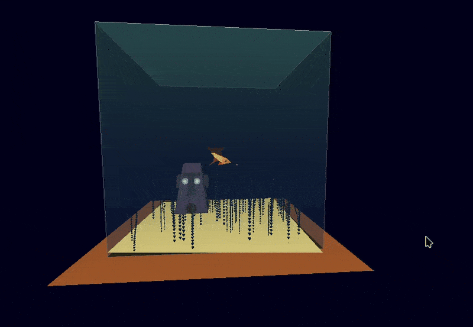

# Aquarium

A simple C++ 3D aquarium made in OpenGL.

## Make sure to install glut (Archlinux example)
>sudo pacman -S freeglut glu mesa

## How to compile and run
>g++ src/*.cpp -I includes -o bin/main -lGLU -lglut -lGL -lm && bin/main
